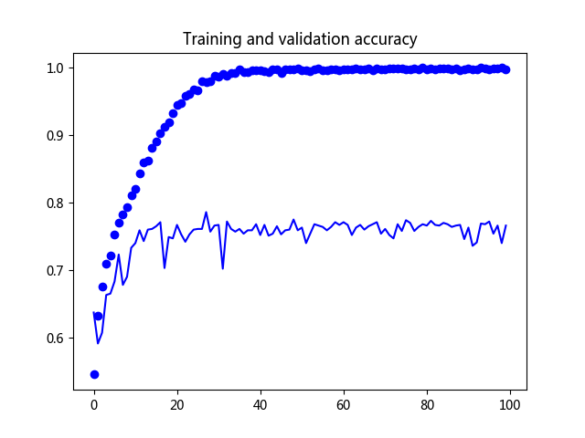
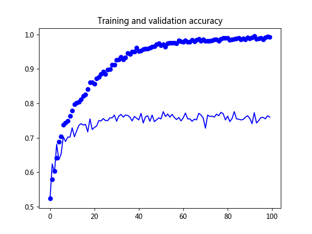
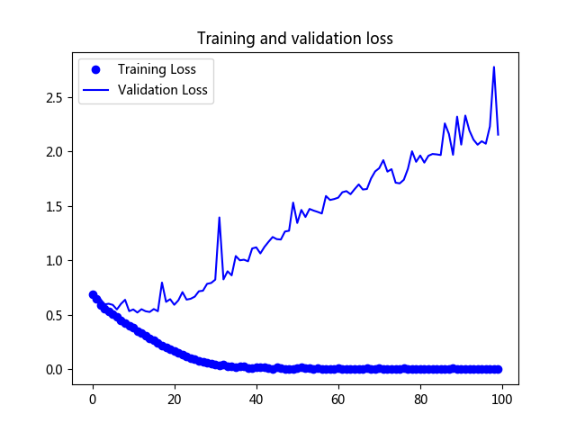
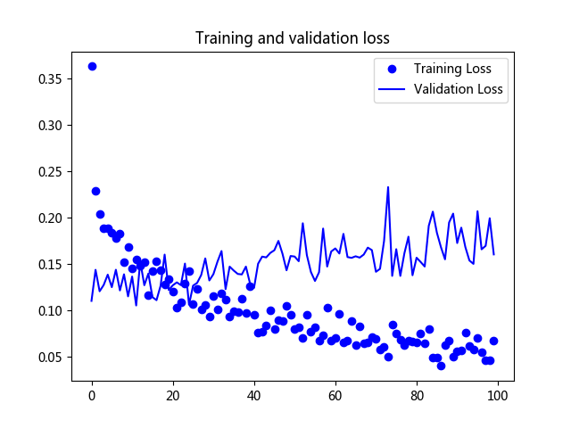

# 使用 CNN 和 TensorFlow 2 金钱豹大战齐天大圣的图像分类


本次开源代码参考来源：

[https://lindevs.com/classify-images-of-dogs-and-cats-using-cnn-and-tensorflow-2/](https://lindevs.com/classify-images-of-dogs-and-cats-using-cnn-and-tensorflow-2/)

[https://www.kaggle.com/c/dogs-vs-cats/data](https://www.kaggle.com/c/dogs-vs-cats/data)


       

   



  

卷积神经网络的网络结构Inception V3

[https://blog.csdn.net/u013841196/article/details/80659132](https://blog.csdn.net/u013841196/article/details/80659132)

迁移训练：

```shell
100/100 - 10s - loss: 0.0619 - acc: 0.9825 - val_loss: 0.1547 - val_acc: 0.9720
Epoch 89/100
100/100 - 11s - loss: 0.0665 - acc: 0.9795 - val_loss: 0.1945 - val_acc: 0.9650
Epoch 90/100
100/100 - 10s - loss: 0.0493 - acc: 0.9845 - val_loss: 0.2041 - val_acc: 0.9640
Epoch 91/100
100/100 - 10s - loss: 0.0549 - acc: 0.9835 - val_loss: 0.1723 - val_acc: 0.9680
Epoch 92/100
100/100 - 10s - loss: 0.0568 - acc: 0.9820 - val_loss: 0.1889 - val_acc: 0.9670
Epoch 93/100
100/100 - 11s - loss: 0.0755 - acc: 0.9815 - val_loss: 0.1680 - val_acc: 0.9670
Epoch 94/100
100/100 - 11s - loss: 0.0607 - acc: 0.9790 - val_loss: 0.1535 - val_acc: 0.9740
Epoch 95/100
100/100 - 11s - loss: 0.0578 - acc: 0.9825 - val_loss: 0.1498 - val_acc: 0.9700
Epoch 96/100
100/100 - 11s - loss: 0.0698 - acc: 0.9785 - val_loss: 0.2067 - val_acc: 0.9630
Epoch 97/100
100/100 - 10s - loss: 0.0540 - acc: 0.9815 - val_loss: 0.1655 - val_acc: 0.9690
Epoch 98/100
100/100 - 11s - loss: 0.0455 - acc: 0.9850 - val_loss: 0.1693 - val_acc: 0.9650
Epoch 99/100
100/100 - 11s - loss: 0.0461 - acc: 0.9870 - val_loss: 0.1991 - val_acc: 0.9660
Epoch 100/100
100/100 - 11s - loss: 0.0672 - acc: 0.9785 - val_loss: 0.1600 - val_acc: 0.9720
```
